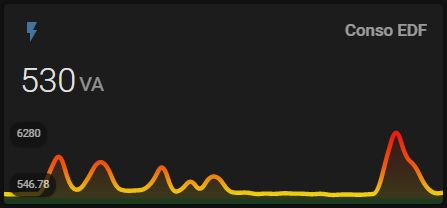

# Mon Home Assistant

> Mise à jour de mon installation au ***5 dec. 2020***

### Sommaire

- [Mon matériel](#mon-matériel)
- [Mon installation](#mon-installation)
  - [Installation de Home Assistant](#installation-de-home-assistant)
  - [Passage en HTTPS](#passage-en-https)
  - [Installation de Zigbee & du 1er capteur](#installation-de-zigbee--du-1er-capteur)
  - [Persistence et visualisation des données](#persistence-et-visualisation-des-données)
  - [Installation de la téléinfo via WiFi](#installation-de-la-téléinfo-via-wifi)
  - [Première notifications sur HA Android via Node-RED](#première-notifications-sur-ha-android-via-node-red)
  - [Installation de Lovelace Mini Graph Card](#installation-de-lovelace-mini-graph-card)
  - [Home Assistant dans Github](#home-assistant-dans-github)
  - [Allumage plafonnier auto via capteurs de présence (En attente de livraison)](#allumage-plafonnier-auto-via-capteurs-de-présence-en-attente-de-livraison)
  - [Récupération de température via 1-Wire / WiFi (prochain projet)](#récupération-de-température-via-1-wire--wifi-prochain-projet)
  - [Installation de Grocy / HA Android](#installation-de-grocy--ha-android)
  - [Pluviomètre (futur projet)](#pluviomètre-futur-projet)
  - [Réseau d'Assistants vocaux (futur projet)](#réseau-dassistants-vocaux-futur-projet)
  - [Système Ambilight](#système-ambilight)
- [Quelques Aides](#quelques-aides)
  - [Github pour les nuls](#github-pour-les-nuls)

## Mon matériel

Vous pouvez voir le détail de mon matériel sur la page [Mon matériel](docs/material.md).

## Mon installation

### Installation de Home Assistant

Mon tuto [Installation de Home Assistant](docs/install-hass.md).

### Passage en HTTPS

Pour sécuriser mes accès à ma domotique, j'ai souhaité que mon Home Assistant soit accessible depuis une URL en *https://...*.
Toutes les étapes sont expliquées dans mon tuto [Installation du protocole HTTPS](docs/install-https.md).

### Installation de Zigbee & du 1er capteur

Vous pouvez voir le détail de l'installation de mon 1er capteur Zigbee Aquara sur ce tuto [Installation de Zigbee](docs/install-zigbee.md).

Suite à cette installation, mon capteur Aquara était visible sans aucun problème.

### Persistence et visualisation des données

Vous pouvez voir le détail de l'installation de la persistence et l'affichage des données sur ce tuto [Persistence et visualisation des données](docs/install-influxdb-grafana.md).

Quelques soucis de mise à jour du graphique côté Home Assistant restent à être réglés ...

### Installation de la téléinfo via WiFi

Vous pouvez voir le détail de l'intégration du capteur ESP32/téléinfo sur ce tuto [Installation de la téléinfo via WiFi](docs/integ-teleinfo.md).

Je peux désormais suivre ma consommation EDF.

### Première notifications sur HA Android via Node-RED

Vous pouvez voir le détail de l'installation de Node-RED et le premier flow concernant une notification lorsqu'une seuil de batterie est atteint dans ce tuto [Notifications sur HA Android via Node-RED](docs/integ-nodered.md).

Pratique pour surveiller la tablette qui fait office de centre de contrôle.

### Installation de Lovelace Mini Graph Card

Vous pouvez voir le détail de l'installation sur ce tuto [Lovelace Mini Graph Card](docs/install-lovelace-minigraph.md).

De superbes courbes avec une variation de couleur en fonction des valeurs.

### Home Assistant dans Github

Suite à une réinstallation complète de mon Home Assistant, j'ai suivi les conseils avisés des "anciens" en sauvegardant ma configuration sur Github pour avoir une gestion des versions.

Vous pouvez voir le détail de l'installation des sauvegardes et l'organisation de mes fichiers de configuration de Home Assistant dans Github dans ce tuto [Home Assistant sur Github](docs/install-github.md)

### Allumage plafonnier auto via capteurs de présence (En attente de livraison)

Vous pouvez voir le détail de l'intégration de ce projet sur ce tuto [Allumage plafonnier auto via capteurs de présence](docs/integ-zigbee.md).

### Récupération de température via 1-Wire / WiFi (prochain projet)

Vous pouvez voir le détail de l'intégration de ce projet sur ce tuto [Récupération de température via 1-Wire / WiFi](docs/integ-1wire.md).

### Installation de Grocy / HA Android

### Pluviomètre (futur projet)

[DIY Zigbee rain gauge](https://community.home-assistant.io/t/diy-zigbee-rain-gauge/255379)

### Réseau d'Assistants vocaux (futur projet)

Vous pouvez voir le détail de l'intégration de ce projet sur ce tuto [Réseaux d'assistants vocaux](docs/integ-rhasspy.md).

### Système Ambilight

[AMBILIGHT et RASPBERRY PI](https://www.youtube.com/watch?v=eIfdLJi3Gvs)
[DrZZZ Ambilight](https://www.youtube.com/watch?v=urOEHzbV48A)
[Hyperion](https://www.home-assistant.io/integrations/hyperion/)

## Quelques Aides

### Github pour les nuls

[L'aide mémoire de github](docs/github.md)
