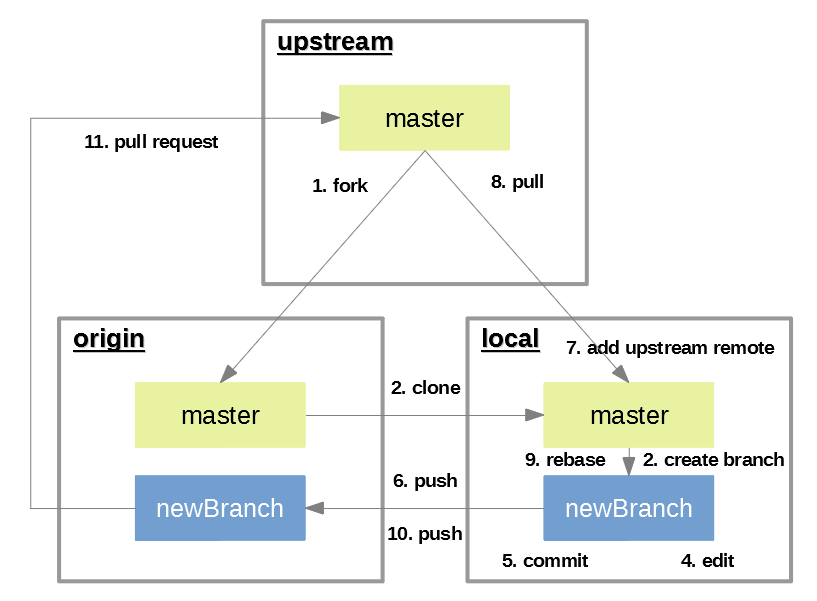

# Les commandes essentielles de Github

### Sommaire

- [Les Forks](#les-forks)
  - [Forker un repository (1)](#forker-un-repository-1)
  - [Récupérer une copie locale (2)](#récupérer-une-copie-locale-2)
  - [Relier sa copie local au repository d'origine (7)](#relier-sa-copie-local-au-repository-dorigine-7)
  - [Créer une branche de travail (2)](#créer-une-branche-de-travail-2)
  - [Maintenez votre fork synchronisé (9)](#maintenez-votre-fork-synchronisé-9)



## Les Forks

### Forker un repository (1)

Sur [Github](https://github.com/), allez sur repository que vous souahitez forker.

Dans le coin en haut à droite, cliquez sur `Fork`.

Ce repository doit apparaitre sur votre Github.

### Récupérer une copie locale (2)

Créer un clone de ce nouveau fork :

```git
git clone https://github.com/<votre-nom-utilisateur-github>/<le-nom-du-fork>
```

### Relier sa copie local au repository d'origine (7)

Reliez votre clone local au repository d'origine :

```git
git remote add upstream <URL du repository d'origine>
```

Verifiez en tapant la commande :

```git
git remote -v
origin https://github.com/<votre-nom-utilisateur-github>/<le-nom-du-fork> (fetch)
origin https://github.com/<votre-nom-utilisateur-github>/<le-nom-du-fork> (push)
upstream <URL du repository d'origine> (fetch)
upstream <URL du repository d'origine> (fetch)
```

### Créer une branche de travail (2)


### Maintenez votre fork synchronisé (9)

Récupérer les mises à jour depuis le repository d'origine :

```git
git rebase upstream/master
```