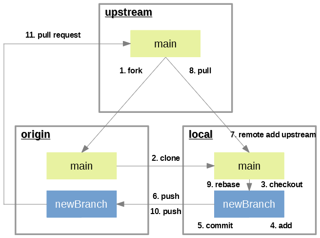

# Les commandes essentielles de Github

### Sommaire

- [La méthode](#la-méthode)
  - [Dupliquer un projet (Fork) (#1)](#dupliquer-un-projet-fork-1)
  - [Récupérer une copie locale (#2)](#récupérer-une-copie-locale-2)
  - [Créer une branche de travail (#3)](#créer-une-branche-de-travail-3)
  - [Modifier votre copie local (#4 & #5)](#modifier-votre-copie-local-4--5)
  - [Mettre à jour votre dépôt distant (#6 & #10)](#mettre-à-jour-votre-dépôt-distant-6--10)
  - [Relier sa copie local au repository d'origine (#7)](#relier-sa-copie-local-au-repository-dorigine-7)
  - [Maintenez votre copie local synchronisé (#8)](#maintenez-votre-copie-local-synchronisé-8)
  - [Maintenez votre branche synchronisé (#9)](#maintenez-votre-branche-synchronisé-9)
  - [Soumettre un correctif (Pull Request) (#11)](#soumettre-un-correctif-pull-request-11)



## La méthode

### Dupliquer un projet (Fork) (#1)

Le `fork` est une copie d'un projet (autre que le votre normalement) en gardant toujours la référence de l'original.

L'idée ici est surtout de copier un projet sur son dépôt Git personnel, de travailler tranquillement dessus, et de pouvoir transmettre vos modifications/corrections (`commit`) au dépôt d'origine via des `pull request`.

Comment faire :

- Sur [Github](https://github.com/), allez sur le dépôt Git que vous souhaitez forker.
- Dans le coin en haut à droite de ce dépôt, cliquez sur `Fork`.
- Ce dépôt doit apparaitre sur votre Github personnel.

### Récupérer une copie locale (#2)

Une fois le `fork` réalisé sur votre dépôt github personnel, vous devez créer une copie local (sur votre machine) de ce dépôt.

Comment faire :

- Créer un clone de ce nouveau fork :

  ```git
  git clone https://github.com/<votre-nom-utilisateur-github>/<le-nom-du-fork>
  ```

- Configurer vos coordonnées :

  ```git
  git config --local --replace-all user.email "<l'adresse-mail-de-votre-compte-Github>"
  git config --local --replace-all user.name "<le-nom-utilisé-sur-votre-compte-Github>"
  ```

C'est sur cette copie locale que vous travaillerez : développer, réaliser des `commit` et les pousser régulièrement sur votre dépôt.

### Créer une branche de travail (#3)

La branche `main` **est** une branche **fonctionnelle**. Pour éviter que vos modifications n'entraînent un bug, il faut toujours travailler sur une autre branche que `main`. Vous devez donc créer une branche qui contiendra vos modifications.

Comment faire :

- Placez vous dans le répertoire de votre dépôt local :

  ```shell
  cd <le-nom-du-fork>
  ```

- Puis créer votre nouvelle branche :

  ```git
  git checkout -b <newBranch>
  ```

### Modifier votre copie local (#4 & #5)

Les modifications sont les `commit`. Le principe au sujet des `commit` est de les faire petit, lié à une correction ou un ajout minimaliste.

Comment faire :

- Placez vous dans le répertoire de votre dépôt local :

  ```shell
  cd <le-nom-du-fork>
  ```

- Ajouter vos fichiers modifiés à l'index :

  ```git
  git add <le-fichier-modifié> <un-autre-fichier-modifié>
  ```

  ou si vous vous voulez prendre toutes vos modifs

  ```git
  git add .
  ```

- Sauvegarder vos modifications :

  ```git
  git commit -m <message de commit>
  ```

### Mettre à jour votre dépôt distant (#6 & #10)

Cette étape permet de mettre à jour votre branche distante avec les modifications de votre branche locale. Elle va être possible grâce à la commande `push`.

Comment faire :

- Pousser vos modifications sur votre dépôt distant :

  ```git
  git push origin <newBranch>
  ```

### Relier sa copie local au repository d'origine (#7)

Suite à votre `pull request`, le propriétaire du dépôt forké accepte vos modifications. Pour que ces modifications soit correctement intégrées à votre dépôt local, il faut relier votre dépôt local au dépôt forké.

Comment faire :

- Placer vous dans le répertoire de votre repository local :

  ```shell
  cd <le-nom-du-fork>
  ```

- Reliez votre clone local au repository d'origine :

  ```git
  git remote add upstream <URL du repository d'origine>
  ```

- Vérifiez en tapant la commande :

  ```git
  git remote -v
  origin https://github.com/<votre-nom-utilisateur-github>/<le-nom-du-fork> (fetch)
  origin https://github.com/<votre-nom-utilisateur-github>/<le-nom-du-fork> (push)
  upstream <URL du repository d'origine> (fetch)
  upstream <URL du repository d'origine> (fetch)
  ```

### Maintenez votre copie local synchronisé (#8)

- Récupérez les modifications sur votre dépôt local :

  ```git
  git checkout main
  git pull upstream main
  git push origin main
  ```

### Maintenez votre branche synchronisé (#9)

- mettez à jour votre branche de travail si besoin (pas nécessaire si vous créer une nouvelle branche depuis main) :

  ```git
  git checkout <newBranch>
  git rebase master
  ```

### Soumettre un correctif (Pull Request) (#11)

Enfin un `pull request` est une proposition de correction ou modification du projet, sous forme de code source ou autres fichiers (images, etc).

Cette démarche est à faire via Github.

Comment faire :

- Connectez vous sur votre Github
- Allez dans le dépôt que vous avez forké
- Cliquez sur l'onglet `Pull Requests`
- Puis sur le bouton vert `New pull request` à droite
- Choisissez la branche de votre dépôt en cliquant sur le bouton `compare: main`
- Puis enfin sur le bouton `Create pull request`
