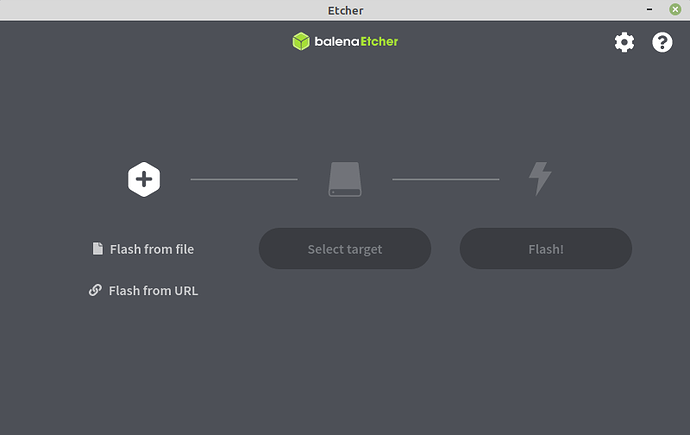
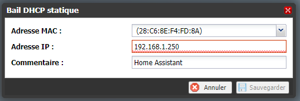
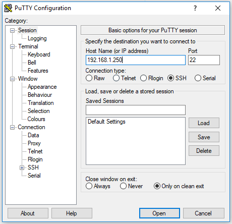
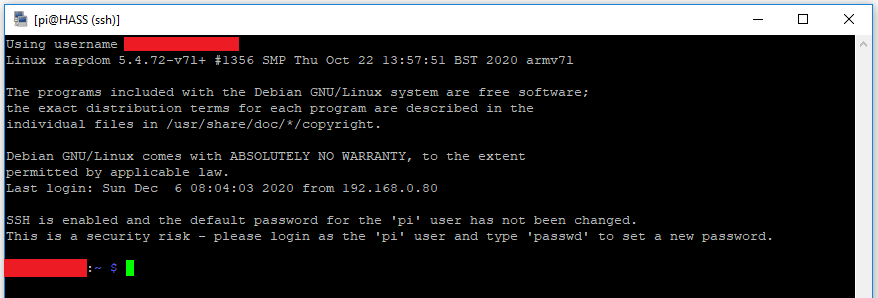
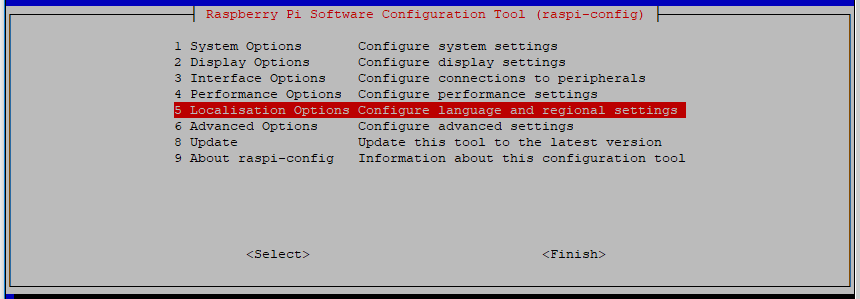
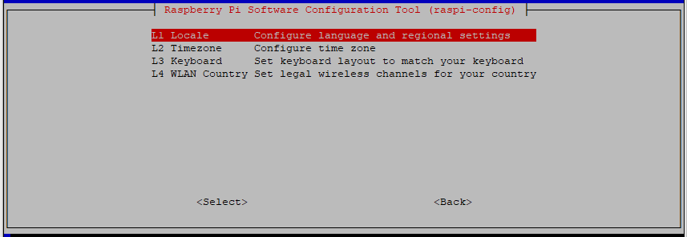

# Installation de Home Assistant

### Sommaire

- [Pré-requis](#pré-requis)
- [Ce qui n'a pas fonctionné](#ce-qui-na-pas-fonctionné)
- [Ce qui a fonctionné](#ce-qui-a-fonctionné)
- [Préparer le RPi](#préparer-le-rpi)
  - [Préparer la carte MicroSD](#préparer-la-carte-microsd)
  - [Bloquer l'IP du RPi via le DHCP](#bloquer-lip-du-rpi-via-le-dhcp)
  - [Se connecter en SSH au RPi](#se-connecter-en-ssh-au-rpi)
  - [Mettre à jour le RPi](#mettre-à-jour-le-rpi)
  - [Changer la version du BootLoader](#changer-la-version-du-bootloader)
  - [Mettre a jour vers la dernière version du bootloader](#mettre-a-jour-vers-la-dernière-version-du-bootloader)
  - [Vérifier la version du BootLoader](#vérifier-la-version-du-bootloader)
  - [Demander le démarrage sur USB](#demander-le-démarrage-sur-usb)
- [Installer le SSD](#installer-le-ssd)
  - [Préparer le SSD](#préparer-le-ssd)
  - [Passer le RPi en français](#passer-le-rpi-en-français)
  - [Changer le Password](#changer-le-password)
  - [Etendre la capacité à toute la carte](#etendre-la-capacité-à-toute-la-carte)
  - [Mise à jour et installation des dépendances](#mise-à-jour-et-installation-des-dépendances)
  - [Arrêt du paquet ModemManager](#arrêt-du-paquet-modemmanager)
  - [Installation de Docker](#installation-de-docker)
  - [Installation de Home Assistant su Docker](#installation-de-home-assistant-su-docker)
- [Suivi des modifications](#suivi-des-modifications)

## Pré-requis

- un Raspberry Pi 4 (perso j'ai un RPi 4 4 Go)
- une alimentation 5V
- une carte microSD
- un disque SSD
- un boitier pour votre SSD

## Ce qui n'a pas fonctionné

J'ai tout d'abord essayé d'installer HA via la méthode la plus simple via ***HassOS*** en suivant ce tuto [Installer Home Assistant sur Raspberry Pi (ou autre SBC) via HassOS](https://forum.hacf.fr/t/installer-home-assistant-sur-raspberry-pi-ou-autre-sbc-via-hassos/201).

Mais, le boot sur mon disque dur n'a pas fonctionné. Je pense que mon boîtier HDD n'était pas compatible, pour ceux qui n'ont pas encore acheté le leur, voici une liste des [boîtiers compatibles](https://jamesachambers.com/raspberry-pi-4-usb-boot-config-guide-for-ssd-flash-drives/)

## Ce qui a fonctionné

J'ai donc testé la solution via ***Docker supervised***.

J'ai installé le boot de mon RPi sur le SDD en suivant ce tuto [Démarrer son Raspberry Pi 4 sur SSD](https://forum.hacf.fr/t/demarrer-son-raspberry-pi-4-sur-ssd/674) puis celui-ci pour installer HA sur Docker [Installer Home Assistant sur Raspberry Pi (ou autres SBC), Debian (Méthode Docker avec Supervisor)](https://forum.hacf.fr/t/installer-home-assistant-sur-raspberry-pi-ou-autres-sbc-methode-docker-avec-supervisor/676)

> Merci à **@McFly** de HACF pour ces tutos, un vrai bonheur !

Voici le détail de mon installation qui est un fork de ceux de @McFly...

## Préparer le RPi

L'installation de Raspberry Pi OS sur une microSD va nous permettre de modifier la configuration du boot du RPi pour qu'il puisse booter sur un disque externe connecté sur un port USB du RPi.

### Préparer la carte MicroSD

J'ai récupéré la dernière image lite de **Raspberry Pi OS** [2020-08-20-raspios-buster-armhf-lite](https://downloads.raspberrypi.org/raspios_full_armhf/images/raspios_full_armhf-2020-12-04/2020-08-20-raspios-buster-armhf-lite.zip) de l'époque de mon installation.

Vous pouvez récupérer la dernière image via le site officiel [Raspberry Pi OS](https://www.raspberrypi.org/software/operating-systems/)

J'ai décompressé ce fichier zip pour avoir un fichier `.img` qui sera utilisé par balenaEtcher.

J'ai récupéré le logiciel [balenaEtcher](https://github.com/balena-io/etcher/releases/download/v1.5.112/balenaEtcher-Portable-1.5.112.exe) en version portable pour Windows. Si vous souhaitez une autre version, vous la trouverez sur le site officielle de [balenaEtcher](https://www.balena.io/etcher/)

1. J'ai lancé le logiciel balenaEtcher

1. Dans *Flash from file*, j'ai sélectionné mon image téléchargée (après l’avoir décompressé)
1. Dans *Select target*, j'ai sélectionné le support sur lequel je voulais l’installer. A ce stade, j'ai choisi ma microSD.
1. Puis j'ai cliqué sur *Flash!*.

Une fois le flashage terminé, j'ai créé un fichier vide nommé `ssh` (**sans extension**) à la racine de la **partition boot** de ma microSD.

La carte étant prête, je l'ai retiré **proprement**, inséré dans mon RPi 4, puis cablé mon RPi avec le réseau ethernet (*beaucoup plus stable que le WiFi*).

Lancement de mon RPi avec le branchement sur l'alimentation...

### Bloquer l'IP du RPi via le DHCP

Sur ma Freebox, dans `Paramètres de la Freebox` puis `DHCP`, j'ai ajouté un bail statique pour mon RPi



> Pour les petits malins, évidemment, ce n'est pas la bonne MAC Address nie la bonne IP !

### Se connecter en SSH au RPi

Je me suis connecter en SSH via Putty configuré sous KeePass (*cette configuration pourra faire l'objet d'un autre tuto*)



Dans :

- `Host Name (or IP address)`, j'ai renseigné l'IP de mon RPi
- `Port`, le port 22. Port utilisé par le protocole SSH
- `Connection type`, j'ai coché `SSH` (normalement pas défaut)

Puis un clic sur `Open`. Vous devriez avoir une fenêtre terminal qui s'ouvre.



### Mettre à jour le RPi

Dans le terminal, j'ai tapé cette commande :

```shell
sudo apt-get update && sudo apt-get full-upgrade && sudo rpi-update
```

A la question `Would you like to proceed?`, j'ai répondu `y` pour accepter la mise à jour. Je ne vais pas renoncé maintenant !

A la fin de la mise à jour, il est demandé de redémarrer, je que j'ai fait par :

```shell
sudo reboot
```

Voilà mon RPi est à jour

### Changer la version du BootLoader

> /!\ en cours de rédaction

### Mettre a jour vers la dernière version du bootloader

> /!\ en cours de rédaction

### Vérifier la version du BootLoader

> /!\ en cours de rédaction

### Demander le démarrage sur USB

> /!\ en cours de rédaction

## Installer le SSD

### Préparer le SSD

J'ai fait comme le chapitre [Préparer la carte MicroSD](#préparer-la-carte-microsd) en modifiant la destination de *Select target*, à ce stade, j'ai choisi mon SSD externe.

j'ai cliqué sur *Flash!*.

Une fois le flashage terminé, j'ai créé un fichier vide nommé `ssh` (**sans extension**) à la racine de la **partition boot** de mon SSD.

Le SSD étant prêt, je l'ai retiré **proprement** du PC. J'ai éteins mon RPi, retiré sa carte microSD, câblé via l'USB 3 à mon RPi 4, j'ai laissé cablé mon RPi avec le réseau ethernet (*beaucoup plus stable que le WiFi*).

Lancement de mon RPi avec le branchement sur l'alimentation...

### Passer le RPi en français

c'est pas que l'anglais me rebute mais je suis francophone alors...

Pour accéder à l'utilitaire de configuration du RPi, toujours dans le terminal :

```shell
sudo raspi-config
```

puis j'ai selectionné `5 Localisation Options`



puis `L1 Locale`



En me déplaçant dans cette liste, j'ai pu déselectionner `en-GB.UTF-8 UTF-8` et sélectionner `fr_FR.UTF-8 UTF-8` en appuyant sur `ESPACE`pour changer l'état de la sélection.

En appuyant sur `TAB`, j'ai déplacé mon curseur sur `OK` et appuyer sur `ENTRER` pour valider.

Une nouvelle fenêtre s'esta affiché pour choisir la langue par défaut. Pas bête, j'ai choisi `fr_FR.UTF-8 UTF-8` puis à nouveau `OK`

### Changer le Password

> /!\ en cours de rédaction

### Etendre la capacité à toute la carte

> /!\ en cours de rédaction

### Mise à jour et installation des dépendances

Pour mettre à jour et supprimer les paquets orphelins, j'ai tapé :

```shell
sudo apt update && sudo apt upgrade -y && sudo apt autoremove -y
```

Puis une autre commande pour installer les dépendances :

```shell
sudo apt-get install -y software-properties-common apparmor-utils apt-transport-https avahi-daemon ca-certificates curl dbus jq network-manager
```

### Arrêt du paquet ModemManager

> /!\ en cours de rédaction

### Installation de Docker

> /!\ en cours de rédaction

### Installation de Home Assistant su Docker

> /!\ en cours de rédaction

## Suivi des modifications

*21/11/2020* : Installation de Home Assistant
