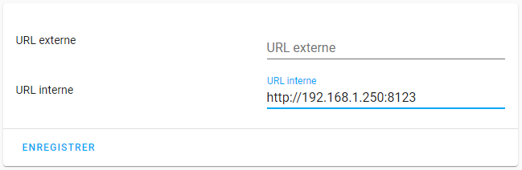

# Installation du protocole HTTPS

### Sommaire

- [Pré-requis](#pré-requis)
- [Ce qui n'a pas fonctionné](#ce-qui-na-pas-fonctionné)
- [Nettoyage d'anciennes installations](#nettoyage-danciennes-installations)
- [Routage des ports](#routage-des-ports)
- [Nouvelle installation](#nouvelle-installation)
- [Suivi des modifications](#suivi-des-modifications)

## Pré-requis

- Avoir installé Home Assistant voir [Installation Home Assistant](install-hass.md).

## Ce qui n'a pas fonctionné

J'ai suivi ce tuto [Accès de l’extérieur en HTTPS avec un NDD Freebox et Let’s Encrypt](https://hacf.fr/acceder-a-home-assistant-depuis-un-nom-de-domaine-freebox-fr/).

Tout a bien fonctionné en HTTPS via mes navigateurs (PC et smartphone) et l'utilisation d'une adresse IP interne. Mais pour [Home Assistant Android](https://play.google.com/store/apps/details?id=io.homeassistant.companion.android&hl=fr), cette configuration ne lui convient pas.
Une solution que l'on m'a proposée a été de passer par un reverse proxy Nginx que j'ai testé via l'addon [NGINX Home Assistant SSL proxy](https://github.com/home-assistant/addons/tree/master/nginx_proxy) avec quelques soucis.

Bref, vous pouvez suivre mes déboires sur ce fil de [discussion](https://forum.hacf.fr/t/acces-https-et-http/1201)...

Suite à une idée très précieuse de @Clemalex du forum HACF, *que je remercie énormément*, j'ai pu mettre simplement mon site en HTTPS.

## Nettoyage d'anciennes installations

- Désinstallation de l'add-on officiel [NGinx Home Assistant SSL proxy](https://github.com/home-assistant/hassio-addons/tree/master/nginx_proxy)
- Suppression des anciens certificats dans le répertoire **ssl** via samba
- Suppression de la configuration dans le fichier `configuration.yaml`

  ```yaml
  http:
    ssl_certificate: /ssl/fullchain.pem
    ssl_key: /ssl/privkey.pem
  ```

- Dans Home Assistant, `Configuration` puis `Général`, laissez vide **URL Externe** et indiquer dans **URL Interne** l'URL de votre Home Assistant (ex : `http://192.168.1.250:8123`)



## Routage des ports

- Dans la configuration de votre Freebox, via l'URL <http://mafreebox.freebox.fr>
- Dans `Paramètres de la Freebox`, puis `Gestion des ports`, créez les règles suivantes :
  - Port 80 :
    - IP destination : IP de l'hôte de Home Assistant
    - Redirection active : coché
    - IP source : Toutes
    - Protocole : TCP
    - Port de début : 80
    - Port de fin : 80
    - Port de destination : 80
  - Port 443 :
    - idem en rempalçant 80 par 443

## Nouvelle installation

en suivant ce [tuto](https://github.com/hassio-addons/addon-nginx-proxy-manager/blob/master/proxy-manager/DOCS.md) (désolé c'est en anglais mais je vais détailler) :

- Installation de [MariaDB](https://github.com/home-assistant/hassio-addons/tree/master/mariadb) si vous ne l'aviez pas déjà pour autre chose.
  - N'oubliez pas de modifier le **user / mot de passe** dans la configuration de l'add-on MariaDB.
- Installation du nouvel add-on [Nginx Proxy Manager](https://github.com/hassio-addons/addon-nginx-proxy-manager).
- Une fois installé, cliquez sur `START`.
- Vérifiez les logs pour être sûr que tout se déroule bien.
- Cliquez sur `OPEN WEB UI`
- Renseignez le compte `admin@example.com` / `changeme` pour votre 1ère connexion.
- Il vous sera demandé de renseigner le compte Admin puis un nouveau mot de passe.
- Dans l'UI de **Nginx Proxy Manager**, cliquez sur `Hosts` puis `Proxy Hosts` puis sur `Add Proxy Host`.
- Dans la nouvelle fenêtre :
  - Domaine Names : le nom de domaine que vous avez (voir DuckDNS pour en obtenir un), ne pas oubliez de cliquer sur `add xxx ...`
  - Scheme : http
  - Forward Hostname / IP : l'IP de votre hôte Home Assistant (voir **URL Interne**)
  - Forward Port : 8123
  - Websockets Support : coché
- Cliquez sur `SAVE`
- Testez si vous pouvez accéder à votre Home Assistant via votre nom de domaine en HTTP en cliquant sur le nom de votre domaine dans la colonne source.
- Si c'est possible, passez votre Home Assistant en HTTPS en cliquant sur les 3 petit point à droite de votre `Source`.
- Cliquez sur `Edit`, puis sur l'onglet `SSL`, choisissez `Request a new SSL Certificat` dans `SSL Certificate` puis cochez `Force SSL`, activez `I Agree ...` puis `Save`. Let's Encrypt va vous fournir un certificat sur votre Home Assistant.

Vous pouvez désormais accéder à votre Home Assistant via `https://<votre nom de domaine>` et ce depuis vos navigateurs comme sur **Home Assistant Android** (en modifiant l'URL dans `Configuration de l'application`, `URL de Home Assistant`).

## Suivi des modifications

- *21/12/2020* : Ajout de précision
- *05/12/2020* : 1ère installation avec HTTPS fonctionnel sur **navigateur** et **HA Android**
