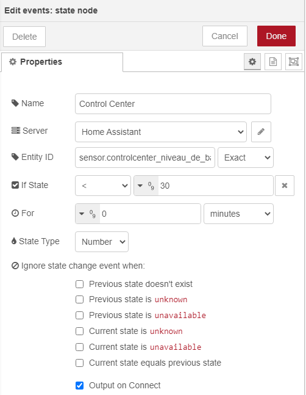
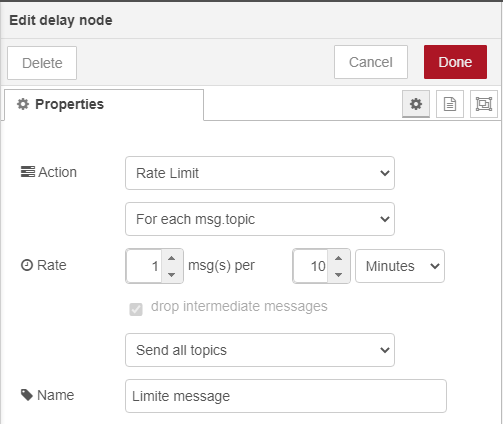
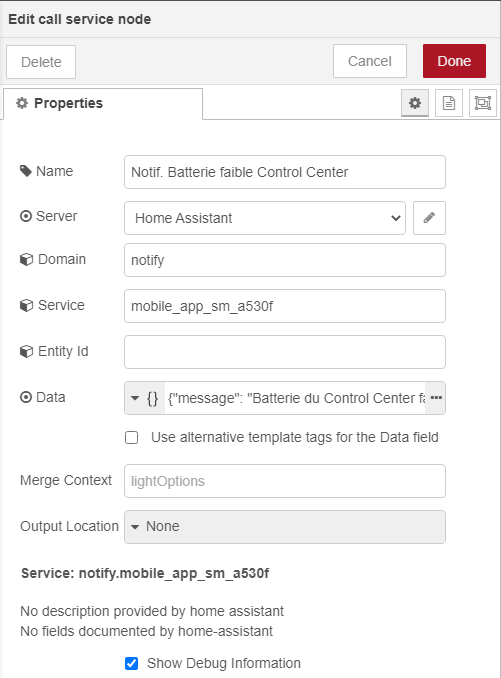

# Notifications sur Home Assistant Android via Node-RED

### Sommaire

- [Installation de Node-RED](#installation-de-node-red)
- [1er Flow](#1er-flow)
  - [Voici ce qu'on va obtenir](#voici-ce-quon-va-obtenir)
- [Suivi des modifications](#suivi-des-modifications)

## Installation de Node-RED

J'ai suivi à la lettre ce tuto [Installer l’extension NodeRed pour Home Assistant](https://hacf.fr/nodered-facilitez-vous-les-automatisations/)

Quelques remarques sur le tuto :

- lorsque vous cliquez sur `Start` et que vous allez voir les logs pour vérifier que tout ce passe bien. J'ai cru que l'installation avait figé car les logs n'évoluait plus. En rafraichissant la page et en retournant dans l'onglet `info`, j'ai pu voir que Node-RED avait démarré.
- Dans le gif sous `Il nous reste à contrôler que Node Red soit bien lié à Home Assistant.`, c'est un **double** clic sur le bouton `Home Assistant` (Je suis rester planter 5 bonne minute avant de voir, :confused: pas doué le bonhomme ...)

## 1er Flow

Je voulais être averti sur mon smartphone que la batterie de mon *Control Center* (une tablette dédié à la domotique :grin:) atteignait un seuil critique qui nécessitait de la recharger.

### Voici ce qu'on va obtenir

Un grand merci à @jybi89 pour son aide.


Je sais, vous allez dire "On connait la fin :unamused:, plus d'intérêt de lire la suite ...".
Mais si vous souhaitez faire ça chez vous, vaut mieux continuer :relaxed:.

Si vous voulez faire ça seul, vous pouvez lire cet excellent tuto [Débuter avec Node-RED](https://forum.hacf.fr/t/debuter-avec-node-red/334) de @McFly.

Bon revenons à notre exemple, pour ouvrir l'interface de Node-RED, cliquez dans le menu latéral gauche sur `Node-RED` si vous avez activer `show in sidebar` lors de l'installation de Node-RED, soit en cliquant dans le menu latéral gauche sur `Supervisor` puis `Node-RED` et enfin `OPEN WEB UI`.

Dans Node-RED, faites un drag&drop d'un noeud `events: state` dans votre `Flow`.

Double cliquez sur ce noeud, dans la fenêtre qui vient de s'ouvrir, il faudra configurer ce que nous allons surveiller.



Les champs :

- `Name`: Le texte qui sera affiché sur le flow
- `Server`: On touche pas, on laisse `Home Assistant`
- `Entity ID`: c'est l'identifiant de l'entité que l'on souhaite suivre. On peut la retrouver dans Home Assistant via le menu `Configuration` > `Entités` colonne `ID de l'entité` ou si vous connaissez une partie de l'ID en tapant dans le champ, une liste apparaitra filtrant les résultats.
- Le champ à droite de `Entity ID`, permet de ciblé plusieurs entités via une rêgle. On laisse pour l'instant à `Exact`
- On coche `If State` pour définir une rêgle de surveillance
- On met `<` puis `30` pour indiquer que la rêgles se déclenchera lorsque le niveau de batterie sera strictement inférieur à 30%
- On laisse `For`
- dans `State Type`, on indique `Number`
- J'ai coché `Output on Connect` pour être averti à chaque fois qu'un déploiement est lancé.

Puis cliquez sur `Done`.

On va maintenant ajouté un noeud `delay`, il ne se trouve pas dans la palette `Home Assistant` mais dans la palette `function`. Faites comme pour le noeud précédent un drag&drop.

Reliez les deux noeuds en cliquant sur la sortie du haut du noeud `events: state` (sortie qui verra passer les messages **si** la rêgle est respectée) puis l'entrée du noeud `delay`.



Les champs :

- `Action`: `Rate Limit`
- `For each msg.topic`
- `Rate` mettez `1` msg(s) et `10` `Minutes` pour limiter le nombre de message à 1 toutes les 10 minutes
- `Send all topics`
- `Name`: Le texte qui sera affiché sur le flow

Puis cliquez sur `Done`.

On ajoute un noeud `call service` qui se trouvedans la palette `Home Assistant`. Faites comme pour le noeud précédent un drag&drop.

Reliez les deux noeuds en cliquant sur la sortie du noeud `delay` puis l'entrée du noeud `call service`.



Les champs :

- `Name`: Le texte qui sera affiché sur le flow
- `Server`: On touche pas, on laisse `Home Assistant`
- `Domain`: `notify` pour notifier sur l'application Android Home Assistant
- `Service`: l'appareil sur lequel vous souhaitez envoyé la notif
- `Entity ID`: c'est l'identifiant de l'entité que l'on souhaite suivre.
- `Data`: Le message envoyer à la notification sur Home Assistant Android. Ce mesage doit avoir un format JSON comme :

```JSON
{"message": "Le message que je veux envoyé !" }
```

Voilà, votre 1er flow est prêt. Un clic sur le bouton `Deploy` en haut à droit et votre flow est actif.

## Suivi des modifications

*12/12/2020* : Création de mon 1er flow sous Node-RED
