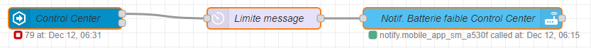

# Notifications sur Home Assistant Android via Node-RED

### Sommaire

- [Installation de Node-RED](#installation-de-node-red)
- [1er Flow](#1er-flow)
  - [Voici ce qu'on va obtenir](#voici-ce-quon-va-obtenir)
- [Suivi des modifications](#suivi-des-modifications)

## Installation de Node-RED

J'ai suivi à la lettre ce tuto [Installer l’extension NodeRed pour Home Assistant](https://hacf.fr/nodered-facilitez-vous-les-automatisations/)

Quelques remarques sur le tuto :

- lorsque vous cliquez sur `Start` et que vous allez voir les logs pour vérifier que tout ce passe bien. J'ai cru que l'installation avait figé car les logs n'évoluait plus. En rafraichissant la page et en retournant dans l'onglet `info`, j'ai pu voir que Node-RED avait démarré.
- Dans le gif sous `Il nous reste à contrôler que Node Red soit bien lié à Home Assistant.`, c'est un **double** clic sur le bouton `Home Assistant` (Je suis rester planter 5 bonne minute avant de voir, :confused: pas doué le bonhomme ...)

## 1er Flow

Je voulais être averti sur mon smartphone que la batterie de mon *Control Center* (une tablette dédié à la domotique :grin:) atteignait un seuil critique qui nécessitait de la recharger.

### Voici ce qu'on va obtenir

Un grand merci à @jybi89 pour son aide.

Je sais, vous allez dire "On connait la fin :unamused:, plus d'intérêt de lire la suite ...".
Mais si vous souhaitez faire ça chez vous, vaut mieux continuer :relaxed:.

Si vous voulez faire ça seul, vous pouvez lire cet excellent tuto [Débuter avec Node-RED](https://forum.hacf.fr/t/debuter-avec-node-red/334) de @McFly.

Bon revenons à notre exemple, pour ouvrir l'interface de Node-RED, cliquez dans le menu latéral gauche sur `Node-RED` si vous avez activer `show in sidebar` lors de l'installation de Node-RED, soit en cliquant dans le menu latéral gauche sur `Supervisor` puis `Node-RED` et enfin `OPEN WEB UI`.

Dans Node-RED, faites un drag&drop d'un noeud `events: state` dans votre `Flow`.

Double cliquez sur ce noeud, dans la fenêtre qui vient de s'ouvrir, il faudra configurer ce que nous allons surveiller.

## Suivi des modifications

*12/12/2020* : Création de mon 1er flow sous Node-RED
