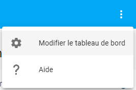

# Installation de la téléinfo via WiFi

### Sommaire

- [Recherches](#recherches)
- [ESPHome et flashage ESP32](#esphome-et-flashage-esp32)
- [Réalisation du shield](#réalisation-du-shield)
  - [Sur Fritzing](#sur-fritzing)
  - [Sur breadboard](#sur-breadboard)
  - [sur PCB](#sur-pcb)
- [Configuration pour la téléinfo](#configuration-pour-la-téléinfo)
  - [Flashage de mon ESP32](#flashage-de-mon-esp32)
  - [Intégration dans une carte Lovelace](#intégration-dans-une-carte-lovelace)
  - [Intégration dans une carte Mini Graph Card](#intégration-dans-une-carte-mini-graph-card)
  - [Ajout de Utility Meter](#ajout-de-utility-meter)
- [Reste à faire](#reste-à-faire)
- [Suivi des modifications](#suivi-des-modifications)

## Recherches

En préparation sur ce fil de [discussion](https://forum.hacf.fr/t/teleinfo-via-wifi/1077/)...

## ESPHome et flashage ESP32

Suite à la réception de mes ESP32, j'ai flashé mon 1er en suivant ce tuto [Installer ESPHome sur Home Assistant et créer votre première configuration](https://forum.hacf.fr/t/installer-esphome-sur-home-assistant-et-creer-votre-premiere-configuration/223)

<u>Quelques remarques :</u>

- Mon ESP32 n'était effectivement pas reconnu sous Win10, il a fallu installé les drivers qui se trouvent sur le site de [silabs.com](https://www.silabs.com/developers/usb-to-uart-bridge-vcp-drivers)
- Après le flashage, dans ESPHome, j'ai vu dans les logs de mon nouveau device :

  ```logs
  WARNING Error resolving IP address of teleinfo.local. Is it connected to WiFi?
  WARNING (If this error persists, please set a static IP address: https://esphome.io/components/wifi.html#manual-ips)
  WARNING Initial connection failed. The ESP might not be connected to WiFi yet (Error resolving IP address: Error resolving address with mDNS: Did not respond. Maybe the device is offline., [Errno -2] Name or service not known). Re-Trying in 1 seconds
  ```

  Je suis donc aller voir à l'adresse indiquée <https://esphome.io/components/wifi.html#manual-ips)> pour ajouter une adresse IP statique à mon ESP32.
  J'ai ajouté un bail statique depuis l'interface de ma freebox pour être sûr.

## Réalisation du shield

### Sur Fritzing


### Sur breadboard


J'vous l'accorde, ça fait un peu plat de nouilles que sur le schéma ...

### sur PCB

> En attente de livraison ...

## Configuration pour la téléinfo

### Flashage de mon ESP32

Reste à configurer mon ESP32 pour qu'il puisse lire la téléinfo ...
Je crois que je ne vais pas pouvoir attendre les plaques de prototypage et je vais me lancer sur une breadboard ...

<details><summary>1ère expérience, infructueuse :unamused:</summary>

Via Samba, je me suis connecté au partage puis copié le fichier `my_tic_component.h` que l'on peut trouver sur le [repository](https://github.com/schmurtzm/Teleinfo-TIC-with-ESPhome/blob/master/my_tic_component.h) de Schmurtzm.

> **Attention** : bien copier le code **RAW** et pas comme moi la première fois `Enregistrer le lien sous...`

Dans ESPHome, j'ai copié le contenu RAW du fichier `ESP32.yaml` en modifiant les données personnelles :

> je n'ai mis **QUE** les données que j'ai modifiées

```yaml
esphome:
  name: teleinfo
  board: nodemcu-32s

wifi:
  # Optional manual IP
  manual_ip:
    static_ip: <IP de l'ESP32>
    gateway: <IP de ma gateway>
    subnet: <masque de sous réseau>


  # Enable fallback hotspot (captive portal) in case wifi connection fails
  ap:
    ssid: "Teleinfo Fallback Hotspot"
    password: !secret ap_pass
#  domain: .local           # Problème d'accès avec cette configuration
#  power_save_mode: LIGHT   # Problème d'accès avec cette configuration
#  fast_connect: false      # Problème d'accès avec cette configuration
#  reboot_timeout: 15min    # Problème d'accès avec cette configuration
#  use_address: tic.local   # Problème d'accès avec cette configuration

# Enable Home Assistant API
api:
  password: !secret ota_pass

ota:
  password: !secret ota_pass
  
# ajout du composant uart pour la communication série avec la sortie TIC du compteur
uart:
  tx_pin: GPIO1     # J'ai utilisé l'UART 0 au lieu de l'UART 2
  rx_pin: GPIO3     # J'ai utilisé l'UART 0 au lieu de l'UART 2
```

Clique sur `SAVE`, puis `CLOSE`, clique sur `VALIDATE` pour vérifier la validité de mon code. Puis `UPLOAD` pour mettre à jour mon ESP32...........

</details><br>

Suite à une discussion sur le forum [HACF](https://forum.hacf.fr) sur la [Téléinfo via wifi](https://forum.hacf.fr/t/teleinfo-via-wifi/1077), j'ai suivi [l'expérience](https://forum.hacf.fr/t/teleinfo-via-wifi/1077/78) de @Jcpas qui avait installé le composant téléinfo encore en développement de ESPHome.

> Avant toutes choses, on `STOP` l'add-on `ESPHome`via le `Supervisor`. Ceci pour éviter tout conflit avec la version de dev.

L'installation des composants ESPhome en version de développement passe par l'installation de l'add-on ESPHome version dev. Pour avoir accès à la version de dev d'ESPHome, il faut ajouter un repository à l'`Add-on Store` du `Supervisor`. Dans le menu latéral de Home Asistant, un clic sur `Supervisor`, puis l'onglet `Add-on Store`, l'ajout se fait via les 3 petits points en haut à droite. Dans la nouvelle fenêtre `Manage add-on repositories`, j'ai collé l'URL suivante puis cliqué sur `ADD` et `CLOSE` :

```url
https://github.com/esphome.hassio
```

Ensuite dans le bloc `ESPHome Home Assistant Add-ons`, on a accès à `ESPHome (dev)`. On clique dessus pour accéder à cet add-on, puis sur `INSTALL`. Après quelques minutes, `ESPHome (dev)` est installé. Avant de démarré `ESPHome (dev)`, n'oubliez pas de stopper `ESPHome` pour éviter tout conflit, si c'est fait, on clique sur `START`. On attend .......

Un fois `ESPHome (dev)` démarré (*on vérifie les logs pendant son lancement pour vérifier que tout c'est bien passé*), j'ajoute un nouveau composant via le gros `+` vert en bas à droite, puis je renseigne comme suit :

- `Node Name`: teleinfo-dev (pour me rappeler que je suis sur une version non stable)
- `Device Type`: `NodeMCU-32S` (C'est ce que j'ai vu le plus souvent dans les docs)
- `WiFi & Updates`:
  - `WiFi SSID`: Le SSID de votre WiFi
  - `WiFi Password`: Le mot de passe de votre WiFi
  - `OTA Access Password`: Le mot de passe pour les mises à jour via WiFi
- `Finish`: clique sur `SUBMIT`

Un nouvel appareil nommé `teleinfo-dev` apparait dans la liste. Je clique sur `EDIT` pour modifier le code du firmware qui sera télécharger sur l'ESP32. Et je colle le code suivant :

<details><summary>Code YAML du composant teleinfo</summary>
<p>

```yaml
substitutions:
  name: teleinfo
  
esphome:
  name: ${name}
  platform: ESP32
  board: nodemcu-32s

wifi:
  networks:
  - ssid: !secret wifi_ssid
    password: !secret wifi_pass

  # Optional manual IP
  manual_ip:
    static_ip: <IP de l'ESP32>
    gateway: <IP de ma gateway>
    subnet: <masque de sous réseau>

  # Enable fallback hotspot (captive portal) in case wifi connection fails
  ap:
    ssid: "Teleinfo Fallback Hotspot"
    password: !secret ap_pass

web_server:
  port: 80

captive_portal:

# Enable logging
logger:
  baud_rate: 0

# Enable Home Assistant API
api:
  password: !secret ota_pass

ota:
  password: !secret ota_pass

# ajout du composant uart pour la communication série avec la sortie TIC du compteur
# GPIO3 = Pin Rx sur ESP32-WROOM-32D
uart:
  id: uart_bus
#  tx_pin: GPIO1
  rx_pin: GPIO3
  baud_rate: 1200
  parity: EVEN
  data_bits: 7
  stop_bits: 1

# déclaration des sensors numérique
# les sensors doivent être déclarés dans l'ordre de la fonction lambda
sensor:
  - platform: wifi_signal
    name: "WiFi Signal Sensor"
    update_interval: 60s
    unit_of_measurement: dB
    accuracy_decimals: 0
    force_update: false
    icon: mdi:wifi
  - platform: uptime
    id: uptime_seconds
    name: "Uptime Sensor"
    update_interval: 60s
    unit_of_measurement: s
    accuracy_decimals: 0
    force_update: false
    icon: mdi:timer
  - platform: teleinfo
    tags:
     - tag_name: "ADCO"
       sensor:
        name: "ADCO"
        unit_of_measurement: ""
        icon: mdi:eye
     - tag_name: "BASE"
       sensor:
        name: "Index"
        unit_of_measurement: "kWh"
        icon: mdi:home-analytics
        filters:
          - multiply: 0.001
     - tag_name: "ISOUSC"
       sensor:
        name: "Intensité souscrite"
        unit_of_measurement: "A"
        icon: mdi:information
     - tag_name: "IMAX"
       sensor:
        name: "Intensité maximale"
        unit_of_measurement: "A"
        icon: mdi:information
     - tag_name: "IINST"
       sensor:
        name: "Intensité"
        unit_of_measurement: "A"
        icon: mdi:power-plug
     - tag_name: "PAPP"
       sensor:
        name: "Puissance"
        unit_of_measurement: "VA"
        icon: mdi:flash
    update_interval: 2s
    historical_mode: true

binary_sensor:
  - platform: status
    name: "Status"

switch:
  - platform: restart
    name: "${name} reboot"

text_sensor:
  - platform: template
    name: ${name} - Uptime
    update_interval: 60s
    icon: mdi:clock-start
    lambda: |-
      int seconds = (id(uptime_seconds).state);
      int days = seconds / (24 * 3600);
      seconds = seconds % (24 * 3600);
      int hours = seconds / 3600;
      seconds = seconds % 3600;
      int minutes = seconds /  60;
      seconds = seconds % 60;
      if ( days ) {
        return { (String(days) +"d " + String(hours) +"h " + String(minutes) +"m "+ String(seconds) +"s").c_str() };
      } else if ( hours ) {
        return { (String(hours) +"h " + String(minutes) +"m "+ String(seconds) +"s").c_str() };
      } else if ( minutes ) {
        return { (String(minutes) +"m "+ String(seconds) +"s").c_str() };
      } else {
        return { (String(seconds) +"s").c_str() };
      }
```
</p>
</details><br>

Je clique sur `CLOSE` puis sur `VALIDATE` pour être sûr que le code est valide.

Je clique sur le s3 petits points de cet appareil, puis sur `COMPILE`. On attend ....... Une fois fait, on clique sur `DOWNLOAD BINARY`. On sauvegarde ce binaire sur un disque qui devra être accessible depuis le PC qui flashera l'ESP-32.

J'ai raccordé l'ESP-32 au PC via l'USB.

Sur ESPHome flasher :


Dans :

- `Serial port`: retrouver le port auquel est raccorder votre ESP32
- `Firmware`: à l'aide du bouton `Browse`, retrouver votre fichier binaire

Un clic sur `Flash ESP`, et on surveille les logs..........

Tout c'est bien passé, voilà votre ESP32 contient le nouveau firmware.

On peut le débrancher et le raccorder à la téléinfo. Je le rebranche, j'attend encore et TADA !, je vois les nouvelles logs apparaitrent dans ESPHome :


### Intégration dans une carte Lovelace

`Configuration`, puis `AJOUTER L'INTEGRATION`, je recherche `ESPHome` et clique dessus.

Dans la nouvelle fenêtre, je renseigne l'adresse IP fixe de mon ESP32 en laissant le port par défaut `6053`, puis clique sur `SOUMETTRE`.

Une nouvelle carte `ESPHome` apparait avec 9 entités.


Dans le dashboard de Home Assistant choisi pour accueillir ces nouvelles infos, un clic sur `Modifier le tableua de bord`



Clique sur `AJOUTER UNE ACTION`, j'ai choisi la carte `Capteur` et dans `Entité`, j'ai choisi `Puissance` ou plutôt `sensor.puissance` puis `ENREGISTRER`

Et voilà, un suivi de la puissance utilisée.

### Intégration dans une carte Mini Graph Card

Il faut d'abord avoir installé HACS et le plugin Mini Graph Card comme sur le tuto [Lovelace Mini Graph Card](install-lovelace-minigraph.md)

Ensuite sur le dashboard sur lequel je voulais ajouter un graphique, j'ai cliqué en haut à droite sur les 3 points, puis `Modifier le tableau de bord`

Pour ajouter la carte, un clic sur `AJOUTER UNE CARTE` et tout en bas de la liste, je clique sur `Manuel`. Cette carte me permettra d'ajouter le code directement.

Dans la nouvelle fenêtre, je colle le code suivant :

```yaml
align_icon: left
color_thresholds:
  - color: '#11f13a'
    value: 600
  - color: '#11f13a'
    value: 800
  - color: '#f0da11'
    value: 1000
  - color: '#ef5a0f'
    value: 3000
  - color: '#ef1d0f'
    value: 5000
entities:
  - sensor.puissance
hours_to_show: 24
hour24: true
more_info: false
name: Conso EDF
points_per_hour: 2
animate: true
show:
  labels: true
  name: true
type: 'custom:mini-graph-card'
```

Et volià, une belle courbe qui change de couleur en fonction des 

### Ajout de Utility Meter

Pour obtenir des aggrégation de données, je vais utiliser `utility_meter` de Home Assistant.

Son utilisation est très simple. J'ai choisi de séparer tout ce qui concerne Utility Meter dans un fichier de configuration à part, donc j'ai créé via le `File Editor`, un fichier `utility.yaml`.

Dans ce fichier `utility.yaml`, j'ai ajouté ce code :

```yaml
# Téléinfo
  consommation_heure:
    source: sensor.puissance
    cycle: hourly
```

> **ATTENTION** à l'indentation

Ce code me permettra d'avoir accès à un sensor qui se nommera `sensor.consommation_heure`.

Pour que ce fichier `utility.yaml` soit accessible, il faut ajouter une inclusion dans le fichier `configuration.yaml` :

```yaml
# utility_meter
utility_meter: !include utility.yaml
```

Un passage obligé de validation, dans le menu, je clique sur `Configuration` puis `Contrôle du serveur` puis sur le bouton `VERIFIER LA CONFIGURATION`. C'est validé.

Un clic sur `REDEMARRER` dans la `Gestion du serveur`.

Voilà un nouveau sensor est accessible qui vous donnera les consommations aggréger sur une heure. Vous pouvez avoir plusieurs aggrégation :

- par heure : `hourly`
- par jour : `daily`
- par semaine : `weekly`
- par mois : `monthly`
- par an : `yearly`

## Reste à faire

- ~~Modifier la fréquence de mise à jour de la courbe de suivi de la puissance (pas assez réactive à mon goût).~~
- Vérifier pourquoi l'index passe à zéro sur le graphique. apparemment le checksum n'est pas fait sur les groupes d'informations de la trame Téléinfo. J'ai donc 3 solutions pour y remédier :
  - Me mettre au C pour comprendre et modifier le code de `my_tic_component.h`. Pas enchanté, vue mes compétences en C...
  - Un nouveau composant `teleinfo` est en développement sur ESPHome mais son utilisation nécessite l'[installation de l'environnement de DEV d'ESPHome](https://forum.hacf.fr/t/teleinfo-via-wifi/1077/55). C'est un peu chaud ... [Pas si chaud que ça au final !](#flashage-de-mon-esp32)
  - Attendre que ce composant sorte officiellement ...

- Sauvegarder les informations dans InfluDB pour avoir un meilleur historique.
- Afficher via Grafana un plus joli graphique.

## Suivi des modifications

*15/12/2020* : Ajout du plugin Mini Graph Card
*13/12/2020* : Ajout du composant teleinfo de dev
*12/12/2020* : Ajout des images du montage de tests
*07/12/2020* : Intégrations du code de suivi de la téléinfo
*04/12/2020* : Flashage de l'ESP32 pour OTA via WiFi
